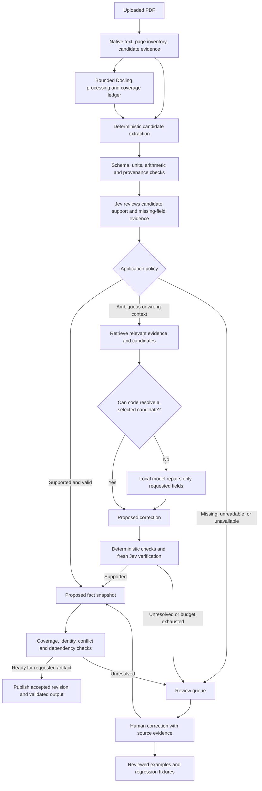

# Jev-assisted extraction and correction

Status: Revised draft following adversarial review. No runtime changes or live model evaluations performed. Deterministic synthetic probes reproduced existing extraction and scoring failures; see [adversarial review](JEV_ADVERSARIAL_REVIEW.md).

Prepared: September 18, 2026.

## 1. Recommendation

Build an evidence-based extraction system with explicit completeness and publication rules. Use Jev in three connected roles:

1. **Select relevant evidence and candidate values.** Let deterministic parsers collect values; ask Jev which candidate matches the field's meaning.
2. **Review extraction and direct bounded repairs.** Convert Jev's structured judgments into a small correction request for the local model, then validate the proposed change against the original evidence.
3. **Identify recurring failures.** Turn reviewed corrections into examples, parser fixes, and regression fixtures that improve subsequent runs.

Build coverage accounting, deterministic parser fixes, and publication checks first; Jev evaluation and targeted repair second; processing shortcuts last. A verifier cannot detect a field it was never asked about, or establish the correctness of OCR that both models share. Section 15 specifies the mandatory reliability contract.

The goal is complete, correct extraction for supported inputs with measured automation coverage, plus explicit resolution for unsupported or ambiguous inputs. No model architecture can guarantee correct autonomous extraction from every possible PDF. Merely abstaining on every report also fails the product goal. Track false acceptance, omission, report completion, and human effort together.

Jev's low cost is an accepted design assumption. Optimize primarily for accuracy, elapsed time, local compute, and review effort. API price is a metric, not the reason to avoid using it.

The user has authorized using Jev. The proposed architecture therefore changes Serafina from an entirely offline runtime to **local document processing and persistence with hosted semantic evaluation**. This document is the plan; it does not activate that integration.

## 2. Current implementation and implications

These observations come from the checked-out source, not a fresh extraction benchmark.

| Current component | What it does | Implication |
| --- | --- | --- |
| `src/services/processors/docling_full_processor.py` | Reads native PDF text, selects a bounded leading page range, runs local Docling, writes sections and native score inputs | Preserve the existing inexpensive native-text pass and page ceiling |
| `costar_page_selector.py` / `costar_scoring_preflight.py` | Select subject coverage and parse demographic/submarket score inputs | Jev should handle ambiguity that these rules cannot resolve, rather than replace exact parsing |
| `src/services/costar_extract.js` | Extracts values for scoring from section content | Needs field-level evidence and candidate output |
| `src/services/processors/docling_transformer.py` | Produces structured property data used by workbook filling | A second extraction consumer must receive the same accepted corrections as scoring |
| `src/services/extraction_pipeline.js` | Processes, resolves the address, looks up local reference data, links the property, and scores it | Review identity before address-based linking; apply accepted facts before scoring |
| `src/services/property_data_assembler.js` | Combines reference, native, and parsed metrics | Replace implicit overwrite precedence with explicit candidate resolution where fields enter review |
| `src/services/property_extract_adapter.js` and `src/api/fillHandler.js` | Transform section files again when filling Excel | Re-transforming raw sections must not discard accepted corrections |
| `src/services/ollama_service.js` | Checks that a configured local model is installed | There is currently no Ollama extraction or correction loop |
| `config/local-runtime-models.json` | Defaults Ollama to `qwen2.5:7b` | Treat it as the initial repair candidate; its extraction quality has not been established here |

Docling uses local layout, OCR, and table models. It cannot consume a conversational critique to fix its weights or interpretation. Feedback can instead change the evidence supplied to a new local LLM repair step, or select a supported Docling reprocessing configuration. Neither action trains Docling.

The historical performance report records approximately 15.17 seconds for a bounded five-page extraction, after an earlier full-document run took approximately 824 seconds. Those are past measurements, not current guarantees. Reopening full-document processing would risk losing the existing improvement. See [performance diagnosis](PERFORMANCE_DIAGNOSIS.md).

## 3. Impact and failure boundaries

| Risk or change | Impact | Architecture response |
| --- | --- | --- |
| Hosted Jev receives document excerpts | Selected content leaves the machine | Send only the necessary text/table headers and candidate values; remove unrelated contact details; keep full PDFs local. Record what was sent. Do not claim zero retention or no training without checking the service terms |
| Wrong model approval | A plausible but incorrect value could reach scoring or Excel | Require source grounding, deterministic validation, calibrated review policy, and visible unresolved states |
| Repeated repair attempts | More latency and local GPU contention | One initial repair per field group, with one additional attempt only when evidence or method changes; enforce a run deadline |
| Network/API failure | Review unavailable | Preserve baseline extraction as explicitly unreviewed; never label failure as support or erase previously accepted values |
| Conflicting extraction paths | Dashboard and Excel could disagree | Both read one versioned accepted snapshot |
| Incorrect property identity | Data could link to the wrong property and reference record | Hold identity changes for review initially; stage the run by file ID before linking |
| Document instructions influence a model | A document could steer review or proposed repair | Treat source text as evidence, restrict outputs to schemas, and keep execution and field permissions in code |
| Same evidence misleads both models | Agreement could appear stronger than it is | Preserve human-reviewed test labels, audit supported cases, and distinguish semantic checks from source-reading quality |

No scoring formulas, thresholds, or business assumptions become model-controlled. Missing data remains missing. Jev reviews whether a value fits its source context; it does not determine whether a property is a good investment.

## 4. Proposed flow



Initially, run Jev after current extraction and record suggestions without changing output. Automatic acceptance and repair are later modes, promoted field group by field group after evaluation.

## 5. Evidence and candidate contracts

Introduce a field registry containing the field's meaning, type, unit, scope, temporal basis, valid source families, missing-value policy, and downstream mapping. For example:

```json
{
  "fieldId": "subject.vacancy.current.rate",
  "meaning": "Current vacancy rate for the subject property",
  "type": "number",
  "unit": "fraction",
  "scope": "subject_property",
  "exclusions": ["submarket vacancy", "market vacancy", "historical vacancy"],
  "missingValue": null
}
```

Canonical field IDs are proposed new identifiers. Explicit adapters map them to existing score and workbook paths; no consumer should guess that mapping.

Every requested field receives a coverage record even when no candidate exists. Record `found`, `not_found_in_searched_evidence`, `unreadable`, `conflicting`, `out_of_supported_scope`, or `not_applicable`, together with searched regions and remaining search work. `not_found_in_searched_evidence` does not mean absent from the report. See section 15 for the completion gate.

Every candidate retains:

- Run ID, document hash, parser version, candidate ID, and field ID.
- Original text value and code-normalized value; for example `5.2%` and `0.052`.
- Evidence IDs pointing to source page, text offsets or table row/column, applicable headers, and surrounding context.
- Scope and period when known, plus extraction method and unresolved ambiguities.

Evidence IDs are assigned by code. Jev and the local model can only select IDs in the supplied catalog. Preserve raw native text and Docling output immutably. Distinguish PDF-page provenance from OCR-derived text: a citation to erroneous OCR does not prove the PDF was read correctly.

Start with native text and tables. Do not assume Jev can inspect PDF images. An unreadable scan needs local OCR or human inspection before text-based semantic review is useful.

## 6. How to ask Jev useful questions

Use narrow questions with explicit exclusions. Batch fields that share relevant evidence, such as a unit-mix table. Do not send the entire report for every field.

| Decision | Jev primitive | Example |
| --- | --- | --- |
| Field support | Choice | `supported`, `wrong_context`, `contradicted`, `insufficient_evidence` |
| Scope of a candidate | Choice | `subject_property`, `comparable`, `submarket`, `market`, `unknown` |
| Candidate selection | Choice | `candidate_a`, `candidate_b`, `none`, `ambiguous` |
| Specific suspected error | Noul | Does this rent value come from the asking-rent column when effective rent was requested? |
| Evidence relevance | Score with a defined rubric | Unrelated; related but insufficient; directly identifies the requested field |

Code checks arithmetic, unit conversion, numeric ranges, dates, and row totals. Jev judges which label, scope, or context applies. A year or radius extracted from a header can be compared deterministically after its meaning is resolved.

Retain raw answers separately from policy decisions. Choice confidence summarizes an answer distribution; it is not calibrated truth. Establish field-specific operating thresholds on reviewed examples, including an abstention region. Do not reuse a cookbook's threshold as production policy. [TypeSafe primitives](https://docs.typesafe.ai/primitives), [confidence](https://docs.typesafe.ai/confidence).

Jev returns bounded answers, not an unrestricted critique or arbitrary corrected values. Serafina builds readable explanations and repair instructions from versioned templates keyed by those answers. This makes the feedback reproducible and prevents invented explanations from becoming instructions.

## 7. Feeding the result back to the local model

### Worked example: vacancy taken from the wrong scope

The following values are synthetic illustrations, not findings from a property report.

1. The parser proposes `subject.vacancy.current.rate = 0.074`.
2. Evidence includes a submarket row showing `7.4%` and a subject-property row showing `5.2%`.
3. Jev classifies the original candidate as `wrong_context` and the scope as `submarket`.
4. Code constructs a correction task. If Jev selects the already parsed subject candidate and it passes policy, code can propose `0.052` directly. No local model call is necessary.
5. If the table structure or association remains ambiguous, the local model receives only that field group and its source context.

Proposed application-level repair request, not a Jev wire response:

```json
{
  "task": "repair_fields",
  "runId": "example-run",
  "baseRevision": 1,
  "allowedFieldIds": ["subject.vacancy.current.rate"],
  "fieldDefinitionsVersion": "v1",
  "currentCandidates": [
    {"candidateId": "c1", "fieldId": "subject.vacancy.current.rate", "value": 0.074}
  ],
  "feedback": [
    {
      "fieldId": "subject.vacancy.current.rate",
      "verdict": "wrong_context",
      "reasonCode": "SUBMARKET_USED_FOR_SUBJECT",
      "instruction": "Find current subject-property vacancy. Exclude submarket and market vacancy. Return unresolved if the supplied evidence cannot establish it."
    }
  ],
  "evidence": [
    {"id": "e1", "page": 4, "text": "Subject Property | Current Vacancy | 5.2%"},
    {"id": "e2", "page": 83, "text": "Submarket Overview | Vacancy | 7.4%"}
  ]
}
```

The task builder also supplies the actual allowed field definitions and a strict output JSON schema. An illustrative response:

```json
{
  "baseRevision": 1,
  "patches": [
    {
      "fieldId": "subject.vacancy.current.rate",
      "rawValue": "5.2%",
      "evidenceIds": ["e1"],
      "status": "proposed"
    }
  ],
  "unresolvedFieldIds": []
}
```

Code then:

1. Rejects unknown fields, invented evidence IDs, malformed output, stale revisions, and attempts to change protected values.
2. Confirms that the raw value is present in the referenced evidence; normalizes `5.2%` to `0.052` itself.
3. Checks field rules and dependent invariants. Changes to a table row trigger validation of the relevant row group.
4. Runs a fresh Jev check against source evidence and field definitions. Do not pass the prior verdict or persuasive model explanation into this verification request. A fresh call is still the same verifier, not independent corroboration. For material or conflicted fields, obtain a blind source-first candidate or a different source-reading path before resolving disagreement; a human inspects the original page when machine evidence remains unreliable.
5. Stages a new revision only if the field's policy passes. The publication gate additionally checks coverage, identity, unresolved conflicts, and affected outputs. Otherwise records an unresolved issue with its evidence.

For inherently derived fields, store source operands and compute the result in code. An exact quoted number check alone cannot validate that it belongs to the correct row or property.

Use Ollama's local `/api/chat` endpoint with a JSON schema in `format`, low temperature, bounded output, and no tools. Implement this as a separate repair adapter, leaving the readiness interface small. Structured output constrains shape; semantic accuracy still requires evaluation. [Ollama structured outputs](https://docs.ollama.com/capabilities/structured-outputs).

### Stop conditions

- Default: one local repair attempt per related field group.
- Permit one additional attempt only if new source evidence, a changed OCR result, or a different supported method is available.
- Stop immediately on an unchanged patch, repeated failed evidence, missing source, or run deadline.
- Jev cannot request arbitrary tools or expand access. Code maps bounded outcomes to allowed operations.
- Failure leaves the field unresolved with a persisted next action; it does not invent a replacement or overwrite an accepted human correction. The attempt limit stops the current method, not the user's entire task: resume with a different supported method, inspect the original page, or request the specific missing source.

This improves the current answer through feedback. It does **not** update the local model's weights.

## 8. Making extraction more efficient

| Mechanism | Expected benefit | Conditions and limits |
| --- | --- | --- |
| Select among pre-parsed candidates | Avoid local generation entirely when the value already exists | Candidate set must include the right value; retain `none` and `ambiguous` |
| Retrieve only relevant evidence | Reduce local-model context and distraction | Include headers and plausible conflicting candidates; measure retrieval recall |
| Repair only failed fields | Avoid generating the whole property object again | Group dependent fields and lock unaffected values |
| Batch Jev questions by evidence group | Reduce request overhead | Split by token budget; dependent retrieval still requires another stage |
| Cache successful judgments | Avoid repeated review on an unchanged extraction | Key by evidence, candidate, model, question, schema and prompt versions; reapply current policy to cached raw judgments |
| Select an extraction method | Send difficult tables to Docling, straightforward native text to code | Later experiment; preserving complete field coverage is the acceptance criterion |
| Warm local workers | Reduce startup overhead across uploads | Independent Docling/Ollama optimization; benchmark memory use and contention |

TypeSafe documents selecting values from a pre-parsed candidate set and verifying a small model's extraction before escalation. These support the architecture pattern, not a prediction of Serafina's accuracy or speed. [Candidate selection](https://docs.typesafe.ai/cookbooks/pre_parsed_value_extraction_cookbook), [extraction cascade](https://docs.typesafe.ai/cookbooks/sde_cascade).

### Later: Jev before expensive document ML

Expose native preflight as a separate reusable artifact before constructing the Docling converter. Let code identify candidate pages/tables; Jev can classify ambiguous page roles or missing field coverage. The current processor initializes its converter before running the native preflight, so saving initialization time requires an actual lifecycle change.

Start by measuring proposed selections alongside today's processing. Only later allow a selected subset, OCR mode, or table mode to change the real run. A selected-page bridge does not exist today; it needs page-number preservation, supported configuration contracts, and coverage tests. Retain the existing leading-page path as fallback.

Never treat a shortened subject section as permission to omit later native demographic/submarket inputs. The project already documents that regression. The existing ten-page ML ceiling remains the initial automatic-work limit, not proof that the document contains no more required data. Persist uncovered fields and candidate later-page locations. A future explicit deep-extraction operation can process targeted extra pages under a separate resource budget; until implemented, the gap requires review. Do not silently classify a report as complete after hitting the ceiling.

Time saved must exceed Jev latency plus any repair time. On easy documents, verification may improve reliability while making completion slightly slower. Measure both outcomes honestly.

## 9. Shared accepted facts and persistence

Add a versioned extraction snapshot between candidate extraction and downstream consumers. Keep it scoped to one run/document before resolving a property identity.

Each field tracks value, status, candidate/evidence IDs, validation results, origin, and revision. Suggested statuses:

- `baseline_unreviewed`: present from the existing pipeline, with no completed semantic review.
- `accepted`: passed the applicable application policy.
- `needs_review`: conflicting or questionable evidence; exclude from authoritative output until resolved.
- `missing`: no value established; remains null and carries a coverage reason. It does not assert global source absence.
- `human_confirmed`: explicitly reviewed and protected from automatic overwrite for that source and period. A replacement report may mark it stale; it does not silently inherit current validity.

Snapshot status should separately indicate `pending`, `complete`, `partial`, or `review_unavailable`. This prevents a successful PDF parse from being confused with complete review.

Proposed SQLite records:

| Record | Contents |
| --- | --- |
| `extraction_runs` | File/document hash, versions, status, mode, timings, budgets |
| `extraction_evidence` | Stable source references and local artifact locations |
| `extraction_candidates` | Raw and normalized values plus provenance |
| `semantic_reviews` | Request hash, model identity, raw answers, rubric, policy outcome, latency |
| `extraction_revisions` | Immutable snapshots and parent revision |
| `extraction_patches` | Proposed/accepted changes, actor, evidence, rejection reason |

Store these in the existing local application-data directory, not the synced repository. Additive migrations preserve legacy runs; legacy values remain labeled unreviewed until evaluated.

Use a transaction to advance the current accepted revision, with an expected-parent check to prevent a delayed model result overwriting newer work. The current `db.connect()` returns the same connection, not an isolated transaction client. Introduce a serialized, synchronous transaction callback with no network/process awaits inside it before adding concurrent review jobs. Treat absent and null fields explicitly; ordinary object spread must not determine source precedence.

Scoring and workbook projections consume the same revision ID. Record it on scores and generated files, along with scoring-config or workbook-mapping version. Generate Excel to a temporary artifact and publish/link only on success; a later accepted correction marks older exports stale rather than editing them silently.

In active review mode, questionable fields are withheld and incompleteness is visible. If Jev is unavailable, users can still access an explicitly unreviewed draft preview/export. Draft identity must be embedded in the workbook and its manifest, not only the browser UI. Published output must pass the readiness contract in section 15. Shadow mode preserves existing output behavior and cannot certify it.

All fill entry points—including `jsonData`, file IDs, property IDs, and section paths—must either resolve an accepted revision or be explicitly marked as legacy/unreviewed inputs. No bypass may acquire a verified label merely because another run passed review.

## 10. Module and integration plan

| Proposed component | Responsibility and integration |
| --- | --- |
| `src/config/extraction_fields.json` | Versioned field definitions, allowed evidence and consumer mappings |
| `src/services/extraction_evidence.js` | Build immutable evidence packets and retrieve candidates with headers/context |
| `src/services/jev_client.js` | Only hosted transport: request limits, authentication, strict response validation, timeout and bounded retry |
| `src/services/extraction_review.js` | Build Jev questions, preserve answers, decide review/repair outcomes through code |
| `src/services/local_extraction_repair.js` | Build scoped requests and call local Ollama with a strict schema |
| `src/services/extraction_snapshot.js` | Candidate resolution, revisions, protected fields and accepted-fact projections |
| `src/api/extractionReviewHandler.js` | Read status/evidence and accept or reject proposed field corrections |
| Existing `extraction_pipeline.js` | Orchestrate staging → review/repair → identity/reference lookup → shared snapshot → score |
| Existing scoring and fill adapters | Consume accepted snapshots; preserve explicit compatibility paths |
| Existing processor modules | Emit richer evidence first; add selective processing only after validation |

Keep orchestration and policy in Node. Python remains responsible for document processing. No Jev API keys or outbound calls in browser code or PDF subprocesses.

Use the documented endpoint `POST https://api.typesafe.ai/v1/systemone` with `state`, `model`, and `questions`. Normalize the provider response behind the adapter rather than exposing provider-specific shapes across the app. [TypeSafe API](https://docs.typesafe.ai/api).

Proposed configuration:

- `SERAFINA_JEV_MODE=off|shadow|review|repair`; begin with `shadow` during evaluation.
- `TYPESAFE_API_KEY` stored server-side; never committed, rendered, or logged.
- `SERAFINA_JEV_MODEL` set to an explicitly evaluated model ID. Record any resolved provider model/version metadata; a moving alias is unsuitable as the sole replay identity.
- Initial engineering defaults: 10-second Jev request timeout, at most one retry for transient failure within the deadline, maximum two concurrent hosted requests, and one local generation at a time. Tune from measured latency; these are not vendor recommendations.
- Initial interactive-pass budgets for measurement: 30 seconds total Jev wait and 60 seconds total local repair time, at most eight hosted calls per pass. These are tuning hypotheses, not quality gates or permanent task limits. Larger runs chunk into resumable groups; exceeding a budget produces a visible pending next action, not hidden truncation or a complete label.

Do not remove the existing loopback restrictions. Give Jev a separate fixed HTTPS destination; retain local-only Ollama and Docling. Reject redirects to unapproved hosts. Update runtime docs and tests to describe this one outbound capability. Jev failure should report degraded review without making local document processing unavailable. The existing Ollama startup requirement can remain initially; any later relaxation is a separate deliberate change.

Use persisted review jobs keyed by run ID and request hash. Return extraction/review state separately so the UI can show baseline results while work continues. Cancellation stops retries and patch publication. Restarting the app resumes unfinished groups without duplicating accepted revisions. A request cache reduces duplicate spend, but does not promise provider-level exactly-once execution.

## 11. Learning from mistakes across runs

Use three distinct feedback paths:

**Within one run:** Jev judgment → templated correction packet → local model patch → fresh verification → accepted revision. This is inference-time correction.

**Across runs:** Human-reviewed cases become a small versioned example library keyed by field, layout family, and error type. Retrieve at most a few relevant examples into future local repair prompts. Keep example values clearly separated from current evidence; an example can explain a distinction but cannot supply the current answer. Evaluate whether examples help before enabling them broadly.

**Engineering improvement:** Aggregate reviewed failure types. If the same merged-table problem repeats, fix the parser or mapping and add a regression fixture. This can remove the need for model calls on that case. A coding agent can receive a reproducible evidence bundle and proposed failure category, but production traces do not automatically trigger code edits or deployment.

Fine-tuning is a later option only if a substantial, diverse reviewed dataset demonstrates a persistent model limitation. Jev labels alone are not ground truth. Keep holdout reports and related layout variants out of training and example retrieval. No automatic weight updates are proposed.

## 12. User experience

Show the normal extracted property first, with explicit review progress. Present an exception list rather than a separate chat interface:

- Field and original value.
- Proposed value, if available.
- Specific issue such as “Submarket vacancy was used for subject vacancy.”
- Source page and highlighted excerpt/table headers.
- Actions to accept, edit with a source, or leave unresolved.

Separate data completeness from the property's score. Explain unavailable inputs and any resulting partial score. Avoid a single percentage that makes semantic confidence look like verified correctness.

Later useful features include identifying which uploaded document could fill a missing field, reconciling conflicting reports while code handles dates, and selecting an existing rescore/export capability from a natural-language request. These reuse the same evidence and bounded-decision contracts; they are not prerequisites for extraction quality.

## 13. Evaluation and staged delivery

### Phase 1 — Evidence foundation and baseline

Add field definitions, evidence references, versioned run records, and common consumer mappings without changing accepted values. Start with property name, subject vacancy, asking/effective rent, and three-mile population. Include submarket vacancy as a contrasting scope. Table rents need stable unit-type row identities, not a single ambiguous rent field.

Acceptance: existing extraction fixtures pass; baseline scoring/workbook projections agree with existing outputs on the same source; human corrections cannot be overwritten; every reviewed pilot candidate has traceable evidence. Preserve unrelated workspace changes.

### Phase 2 — Jev shadow review and candidate selection

Use approximately 100–200 human-reviewed field cases as an initial diagnostic set, drawn from multiple reports and layouts. The two current sample reports cannot establish generalization. Include correct values, missing values, wrong scope/radius/period, OCR errors, conflicts, shifted rows, unfamiliar layouts, and adversarial source text.

Measure error-detection precision/recall, false acceptance, false alarm rate, abstention, evidence/candidate recall, and added latency. Audit some supported cases, not only flagged ones. Keep related documents and variants together in development/holdout splits.

### Phase 3 — Targeted local repair

Add structured Ollama repair and fresh verification. Compare on identical cases:

1. Current extraction only.
2. Current extraction plus Jev review/candidate selection.
3. Current extraction plus local repair using deterministic error signals only.
4. Current extraction plus Jev-directed local repair and verification.

This separates the benefit of Jev from the benefit of merely adding a local model. Record harmful corrections as well as successful ones.

The original 95% accepted-repair precision target is withdrawn: it is too weak as a basis for dependable multi-field reports. The pilot diagnoses failures; it does not authorize unattended publication. Require zero known critical failures in the challenge suite, disclose all holdout errors, and report document-level completeness/correctness, false acceptance, omissions, abstention, human effort, and confidence intervals by layout/field class. Define numerical production error and automation-coverage limits before release; they remain unresolved requirements rather than invented guarantees. Until adequately evaluated, material changes and final outputs require source-backed review. Identity changes remain human-reviewed initially.

### Phase 4 — Shared accepted output and review UI

Enable selected repair policies behind configuration. Migrate scoring, rescore, reference refresh, and every Excel fill route to the same accepted revision. Exercise restart, stale response, model outage, unavailable credentials, invalid JSON, rejection, and rollback paths. Rollback restores a prior accepted revision and regenerates derived output; it does not erase the audit history.

### Phase 5 — Reduce local document/model work

Compare native-text candidate selection, scoped model context, selective Docling processing, and warm workers independently. Use held-out end-to-end reports. Promote only if field completeness and error rates remain within the chosen baseline tolerance and median/p95 time or local resource usage improves.

Capture stage time, OCR/ML pages, local prompt/generated tokens, local repair count, peak memory, hosted calls, review effort, and time to an accepted result. Measure cold and warm starts separately. Do not advertise a speedup until the complete workflow demonstrates it.

Routine unit tests use recorded/fake provider responses. Live semantic evaluation is an explicit command with versioned results. Replaying a response tests integration behavior, not the current model's accuracy.

## 14. Recommended first implementation slice

First fix and test deterministic header/radius selection, signed numeric parsing, cross-page field completion, and missing-input decision eligibility. Implement the coverage registry, snapshot compatibility layer, publication gates, and shadow Jev review for the pilot fields. Then add one complete repair path for subject vacancy versus submarket vacancy, from source evidence through local repair to both scoring and Excel projection. Pilot-field completion must never label the entire report verified.

That slice proves the essential mechanism: Jev identifies a specific semantic mistake, Serafina supplies a bounded correction task, the local model proposes a grounded repair, and both user-facing outputs use the accepted result. Expand to table rows and selective processing once that works measurably.

## 15. Reliability contract added after adversarial review

### Coverage and meaning before acceptance

Define a versioned supported-input profile and an output-specific required-field manifest. A CoStar extraction, a scorecard, and a complete underwriting workbook have different requirements. Fields that require separate financials or business assumptions cannot be certified from a CoStar PDF. Optional omissions remain visible; required unresolved fields prevent publication of the relevant artifact.

Identify a fact by property/entity, field, reporting period, geographic radius or submarket, and row identity where applicable. Store source publication date separately from measurement date and import time. Preserve each source claim; do not collapse distinct periods or override conflicts using arrival order. A source can accurately report an outdated or incorrect real-world fact: extraction support means fidelity to that source, not independent verification of the world.

Preserve row/column headings, table identity, cell coordinates, footnotes, and units. Reordered columns must not change meaning. A dash is unknown unless the applicable source convention establishes zero. Negative growth must parse. Duplicate unit types cannot be identified only by bed/bath. Distinguish published rounded totals from exact arithmetic, with field-specific rounding tolerances.

For each required field, inspect both positive evidence and completeness: was relevant content found, did processing cover it, are there conflicting candidates, and is the source readable? Retrieval failure, parser failure, and genuine source absence are different outcomes. A missing candidate should trigger search/inspection, not disappear from the review batch.

### Independent checks and escalation

The repairer's critique and the repaired candidate must not become the sole verifier input. For material fields and challenged layouts, compare against a source-first extraction that did not see the proposed value. Where OCR is suspect, use a different source-reading path or original-page inspection; asking two language models about identical bad text does not address the error.

Corroboration is evidence diversity, not vote counting. No majority rule or average confidence can override conflicting source readings. Assess independent-pass value experimentally; it adds latency and can share failures. Use deterministic checks everywhere and stronger evidence selectively based on field impact, layout novelty, parsing disagreement, and measured failure patterns.

Order recovery by the failure: missing candidate → broader relevant search; bad table structure → local table/OCR reprocessing; semantic mismatch → scoped generation; unresolved source reading → original-page review. Benchmark a stronger local extractor against the small-model repair cascade. If one stronger pass yields better end-to-end correctness and completion time, use it. Keep the backend replaceable; Qwen is not a settled architectural choice.

### Publication is a separate operation

Maintain a readiness vector for identity, field coverage, semantic support, source conflicts, scoring eligibility, and workbook integrity. No single confidence number substitutes for these checks. Accepted observations may exist in a partial snapshot, but its requested artifact must independently qualify for publication.

The existing scorer returns score zero and `Rejected` for entirely absent input. Preserve formulas for complete inputs, but put a deterministic eligibility wrapper before business decision publication. Initially, any unresolved required score factor produces `Insufficient data` rather than `Rejected` or `Move Forward`; do not silently renormalize weights. Treat business acceptance of any partial-score policy as an explicit separate product decision.

Excel generation must reopen and validate the actual generated file: expected sheets, mapped values/units, row alignment, required mappings, protected formulas, and template/mapping hashes. Missing required sheets or skipped required fields fail publication. Store extracted text as literal strings even when it begins with formula-like characters; only versioned template code can supply formulas, hyperlinks, cell addresses, or output paths. Workbook filling and spreadsheet formula recalculation are separate: if calculated outputs are delivered as current, verify them with a supported spreadsheet engine; otherwise disclose that recalculation is pending. Never treat a successful file save as proof of a correct workbook.

Create output from a frozen revision; write a staging file, validate it, atomically rename it on the same filesystem, and then record its ready manifest. A crash after rename but before database commit creates an orphan for reconciliation, not a published artifact. Downloads resolve through ready manifests; staging/unregistered files are not directly served. A crash cannot create a database reference to a ready file that was never validated.

### Durable execution and invalidation

Use one local durable job runner with leases, attempt IDs, expected revision checks, and cancellation generations. Expired leases are reclaimed; stale/cancelled results cannot publish. A process restart resumes or exposes an actionable error. Disk-full, corrupted artifact, missing source, duplicate submission, and unavailable models have explicit persisted outcomes. No new distributed infrastructure is required.

Fingerprint document bytes, evidence transforms, field definitions, candidate catalog, model identity, generation options, prompt/rubric, reference snapshot, and consumer configuration. Hash mismatches invalidate affected work. A human confirmation attaches to its evidence and period; new source data prompts revalidation instead of carrying it forward indefinitely.

Repeated Jev calls may vary; caching improves reproducibility but does not prove accuracy. Re-score reviewed canary cases when model/backend behavior changes. If a provider alias cannot be resolved to an immutable version, record that limitation and require re-evaluation before continuing unattended publication. Do not claim response replay reproduces current inference.

### Release evidence

Required adversarial families include reordered columns, signed/parenthesized numbers, split/duplicate tables, conflicting periods, swapped property identity, missing pages, incorrect OCR, missing required mappings, changed templates, injected instructions, late responses, duplicate jobs, crash boundaries, disk-full, and model drift. Tests assert both correct accepted values and correct refusal to publish. Label fixtures from original source pages, with independent adjudication of material disagreements.

Measure complete documents, not only preselected field snippets. Related fields/reports are correlated; do not multiply model confidence values into a document assurance score. The 100–200 case pilot remains a discovery exercise. Production release needs a defined error budget and sufficient representative evidence; high abstention cannot be used to conceal poor task completion.

The standard is: no known path to silent incorrect publication, complete recoverability for the tested failure envelope, and measured extraction quality on supported documents. This is a testable engineering commitment, not a promise that arbitrary source material or probabilistic judgments can never be wrong.

## References and status

- [Jev ideas brief](</Users/jish/Documents/ChatGPT/Jev Ideas/JEV-IDEAS.md>) — source ideas, not execution instructions.
- [Local runtime](LOCAL_RUNTIME.md) and [coverage checklist](costar_coverage_checklist.md) — existing processing and missing-data contracts.
- [TypeSafe limitations](https://docs.typesafe.ai/model-jaggedness/jev-1.13) — reason to keep arithmetic, permissions, and bounded failure handling in code.
- [TypeSafe model catalog](https://docs.typesafe.ai/models) — select and record the evaluated deployment model at implementation time.

Provider documentation was consulted while drafting. No Jev accuracy, local repair quality, cost, or speed measurements were performed for this plan. All newly named modules, tables, modes, endpoints within Serafina, and thresholds above are proposals.
